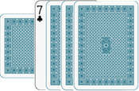
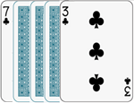
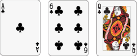

Aristocracy
===========

*Aristocrats don't work. They own land, make money off their estate, and play cards in their chateau.*

Created by Felix Leeb over the course of the Summer of 2018 (and beyond). Dedicated to Lauren Martini.

# Setup

The game is played with two full decks of playing cards (52 cards, no jokers) and a pool of coins. The game is for 2-5 players (recommended 3-4).

The King, Queen, and Jack of diamonds are removed to be used as the phase counter.

Deal each player 7 cards face-down and place the remaining cards in the middle of the table face down to form the deck. Each player may look at their cards and they also begin with 3 coins.

# Overview

The game is played over a series of rounds, each of which has three phases. Each phase corresponds to one of the three royals (King, Queen, and Jack). The first phase of every round is the King phase, followed by the Queen phase, and finally the Jack phase.

Before the beginning of every round one player is designated the Herald. In the very first round, the Herald is chosen randomly. Place the royals (King, Queen, and Jack of diamonds) in front of the Herald in a face-up stack with the king on top, followed by the queen and then the jack. At the end of each phase, the Herald flips the current top royal to the bottom revealing the next active royal. After the jack phase, the Herald passes the stack of royals to the player to their left (clockwise order) who now becomes the new Herald.

## Phase Overview

1. Announce public market - **draw 2 cards** from the deck and place them face up in the center of the table for all to see.
2. Each player **draws 1 card** (except in the very first king phase) in Herald order.
3. Complete royal event of the currently active royal:
    1. King – Tax – all players must **discard** their hand down to their max number of cards
    2. Queen – Ball – the players may contribute to the **ball**
    3. Jack – Auction – add 1 additional card to the public market and complete the **auction**
4. Form your stall – each player chooses **any number of their cards** and places them face-down in front of them in Herald order. Once all players are ready, all players turn the cards they chose face-up in front of them, forming their market stall.
5. Determine the next active player – from those players who have not had a turn yet in this phase, the player with the **smallest total stall value**. The stall value is defined as the sum of the rank of all cards in their stall (A = 1, KQJ = 10, 2-10 = 2-10) (note that some actions of previously active players may change the subsequent turn order)
6. The active player takes **one of the actions below for each card in their stall**. The possible actions are (the same action can be taken multiple times):
    1. **Trade** – swap any card in your stall with any card in an opponent's stall or the public market
    2. **Store** – swap any card in your stall or hand with any building card in one of your buildings
    3. **Hide** – take one card in your stall into your hand
    4. **Sell** – discard two cards in your stall and take a coin
    5. **Harvest** – take the production card in any one of your farms into your hand
    6. **Favor** – discard a face card (from your stall or hand) and take the corresponding special action
    7. **Downgrade** – take one building card from any building you own into your hand (if it was a farm then take all remaining building cards and the address card into your hand as well, and that building ceases to exist)
    8. **Royal** – pay 1 coin and take the action of the royal of the current phase
    9. **Pass**
7. Repeat step 5 until all players with at least 1 card in their stall have taken their actions
8. Clean up – all remaining **public market cards are discarded** (in the order they were drawn).
9. End of phase – all players **take all the cards in their stall into their hands**, and then depending on the phase the end event occurs:
    1. King - any player may **end the game**, provided they meet the necessary criteria, in which case all players begin scoring
    2. Queen - each player **takes one coin per estate or chateau** they own
    3. Jack - each player **adds one production card face down to each of their farms that don’t already have a production card**

# Royal Events

There is a unique event associated with each royal that is completed at the beginning of their phase (see round overview).

## King – Tax

Each player’s max hand size is defined as 7 + (number of chateaus they own). Any player with more than their max hand size at the beginning of the Tax phase must discard down to their max hand size.

## Queen – Ball

All players bid any number of their cards face down. The bid cards + the public market cards are shuffled together face down, and distributed so that each player gets the same number of cards they bid back. The remaining cards make up the public market.

## Jack – Auction

After a third card is added to the public market, each player bids secretly by placing some number of their coins underneath their hand cards. Once everyone is ready, the bids are revealed, and the player that bid the most pays as many coins as the second-highest bid and takes one card from the public market of their choice into their hand. Everyone else keeps the coins they bid. If there is a tie for the highest bid, then all tied players (in Herald order) declare which card they wish to purchase and any card for which exactly 1 player bid that player may take (paying the price of the second-highest (which here is the same as the highest) bid), and any card for which more than one player bid is discarded (with the players keeping their money). Any cards no one bid for remain in the public market.

# Royal actions

In addition to the special events at the beginning of each phase, and the special effects at the end of each phase, the royals also allow players to take **special actions** during their phase. During the phase of a particular royal, only that royal's special action may be taken using the "Royal" action by paying one coin, meanwhile, the "Favor" action can always be taken using any face card, regardless of what phase it is. For example, if it's the King phase then players may take the building action by paying one coin, but they are also free to play a king, queen, or jack from their cards activating the respective action.

## King – Build

Place one card face up in front of you (the address card), followed by 3,4, or 5 face-down cards (building cards) each of which can be from your hand or stall to build a farm, estate, or chateau respectively. The rank of the face-down cards do not necessarily have to match the rank of the address card, however, if they do not match, this building is liable to a penalty if visited (see visitation). A player may directly build any building (farm, estate, or chateau) or they may upgrade an existing farm or estate by adding face-down building cards, however, the address card may not be changed.

## Queen – Visit

Choose one building owned by an opponent and look at all building cards in that building. If all building cards match the address card of the building, then you return the building cards without penalty and the visit ends. If, however, at least one of the cards do not match, then the owner of the building must pay you one coin (if they have one), and you may choose one of the non-matching cards and leave it face-up (turning any other building cards face down again). If you visit a building that already has a non-matching card face up, then you choose either to discard the offending card (instantly degrading the building from chateau to estate or estate to farm, or if the building was a farm, then address card and the remaining building cards are all returned to the owner, and the building ceases to exist) or the owner must pay you one coin (if they have one). The face-up non-matching card is treated as a regular building card and may be swapped by the owner for a different face-down card with the "Store" action.

## Jack – Buy

You may select any one of the face-up cards in the discard pile and take it into your hand. Replace the taken card with the bottom face-down card in the discard pile.

# Buildings

Buildings are defined by a single face-up address card and a certain number of face-down building cards. Buildings can be built or upgraded using the build action (special action of the king), but they can also be downgraded (either voluntarily as an action, or as a result of a visit). Farms, estates, and chateaus comprise of 4, 5, and 6 cards total (including the address card). Even a building that is incomplete (it contains building cards that don’t have the same rank as the address card), still has the effects below, however, it will not count as victory points during scoring.

## Farm

Allows for the storage of one production card. Production cards are placed face down at the end of the jack phase, and no one may look at them (even in a visitation) until you harvest the card with a harvest action. If a farm with a production card is upgraded or downgraded, then the production card is discarded, without looking at it.

## Estate

Produces 1 coin at the end of each queen phase.

## Chateau

Produces 1 coin at the end of each queen phase. Furthermore, each chateau increases your maximum hand size by one.

# Game End and Scoring

The game can only end if a player decides to end the game at the end of a king phase. That player must turn all building cards of their buildings face up. All buildings which do not contain any non-matching building cards are considered complete. To cause the game to end, that player must present 1 complete chateau in addition to at least one of these three options:

- 1 chateau
- 2 estates
- 3 farms

If they fulfill these criteria, then all players flip their building cards face up and count their victory points, counting only the completed buildings they own:

- Chateau – 3 points
- Estate – 2 points
- Farm – 1 point

The player with the most victory points wins. In the case of a tie, the first tiebreaker is having the most money, then having the highest total value in their hand cards, and finally the Herald order.

# Notes

- For all bids and when forming stalls for the market, players must get ready in Herald order (starting with the Herald and clockwise from there). A bid/stall of 0 coins or 0 cards (then the value is 0) is allowed.
- Discarded cards are always discarded face down in a pile, however, the bottom 4 cards in the discard pile are turned face up for all to see (as they can be bought with the jack's special action). Once the drawing deck is depleted, the entire discard pile (face up and down) is shuffled to produce a new drawing pile.
- There are three ways to gain coins and three ways to use/lose coins. Gaining: owning a chateau or estate at the end of the queen phase, selling cards in your stall, or visiting an incomplete building. Using/Losing: buying a card during an auction, using the “Royal” action, or the result of someone visiting one of your incomplete buildings. Effectively, a coin is approximately as valuable as a card.

# Variants

There are several variants of Aristocracy to change the game length and complexity. The easiest way is to vary the number of cards used to build buildings. The base game uses 4-5-6, however, a variant to make the game longer could be 5-6-7 or 4-5-7. It is suggested that the max hand size (and starting hand size) is always one less than the cost of two farms (like 7 in the 4-5-6 game). A shortened version could also be played with 2-3-4 using only one deck, with a max hand size of 5 (note that then complete chateaus can’t be built with face cards).

# Glossary

- Your cards – cards in your stall + those in your hand
- Building card – all cards in a building excluding the address card production card
- Address card – the single face-up card in each building
- Production card – the card produced by the farm which can be harvested as an action
- Complete building – any building that does not contain non-matching building cards (excluding production cards)
- Card value – rank of the card: Ace = 1, 2-10 = 2-10, Face card = 10
- The royals – the King, Queen, and Jack of diamonds (used to designate the current phase)

# Card Organization

Here are some suggested ways to orient the cards so the types of all cards in play is clear to all players.

## Buildings

Examples of (left to right) a farm, estate, and chateau. The address card is face up and always placed on the bottom, followed by the face-down building cards.

An example of a Farm with a production card. The production card may be harvested with a “Harvest” action.

An example of an estate that has been visited, and has at least 1 non-matching card (the 3). The address card remains the 7 (as it is the face-up card on the bottom). If the owner plays a “Store” action they may exchange the face-up 3 for another one of their cards face down. Alternatively, the owner can use the “Downgrade” action to pick up the 3, which would turn the estate into a farm.

## Stalls

It is suggested that you place your stall cards face up vertically, and then when it’s your turn that you rotate one of your cards after every action you take. If you discard one or more of your stall cards due to an action flip it face-down, and then only after you have completed all your actions, discard the face-down stall cards. This way you can keep track of how many actions you’ve taken this phase.

An example of a stall with a stall value of 17, where no actions have been taken.

An example of a stall after two actions have been taken, one involving discarding the rightmost stall card (eg. discarding the queen as part of a “Favor” action). When rotating stall cards, it doesn’t matter what order you rotate them, this is merely a tool to keep track of how many more actions you can take in this phase.
