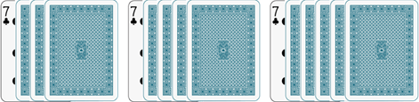
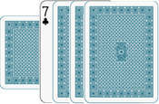
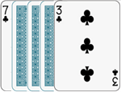
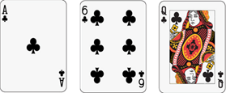
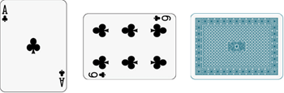

--- <!-- https://chatgpt.com/c/675072dd-23ec-8005-9e2c-71b0bd8f80a6 -->

**Aristocracy**
===============

> *Aristocrats don't work. They own land, make money off their estates, and play cards in their château. Can you handle that?*

Created by Felix Leeb over the course of the Summer of 2018 (and beyond). Dedicated to Lauren Martini.

---

## Introduction

Aristocracy is a strategic card game for 2–5 players (recommended 3–4) that combines elements of bidding, building, and resource management. Players assume the roles of aristocrats aiming to build the most prestigious estates while managing their resources efficiently.

---

## Components

- **Cards**: Two standard 52-card decks (no jokers)
- **Coins**: A pool of tokens to be used as coins.

---

## Setup

1. **Round indicators**: Remove the King, Queen, and Jack of diamonds from one of the decks to be used as round indicators.
2. **Deal Cards**: Shuffle the two decks and deal 7 cards face-down to each player. Players may look at their cards. Place the remaining cards face-down somewhere reachable by all players to form the draw pile.
3. **Distribute Coins**: Give each player 3 coins.
4. **Choose the Herald**: Randomly select a player to start as *Herald*. The Herald is given the round indicators and places them in front of with the King on top, then the Queen, and finally the Jack on the bottom.

---

## Game Overview

The game consists of multiple *years*. Each year consist of three rounds, one for each of the royals in the following order: King -> Queen -> Jack.

At the beginning of each round, the Herald places the royal corresponding to the new round on top. After the jack phase (a.k.a. end of the year), the Herald passes the stack of royals to the player to their left (clockwise order) who now becomes the new Herald. *Herald order* starts with the herald and proceeds clockwise around the table.

---

## Phase Sequence

Each phase follows these phases:

1. **Public Market Announcement**: The herald draws 2 cards from the deck and places them face-up in the center of the table for all to see.
2. **Player Draw**: Each player draws 1 card from the draw pile in Herald order. (Skip this phase in the first King round of the game)
3. **Royal Event**: Perform the event specific to the current royal:
   - **King (Tax)**: Players must discard cards from their hands down to their maximum hand size (which is 7 + the number of châteaux they have).
   - **Queen (Ball)**: Players may contribute cards to the ball. (See below)
   - **Jack (Auction)**: Add an additional card to the public market and conduct the auction. (See below)
4. **Form Stalls**: In Herald order, players select any number of cards from their hands and place them face-down in front of them to form their stall. Once all are ready, all players reveal their stalls at the same time by turning the cards face-up.
5. **Determine the Active Player**: The player with the lowest total stall weight (sum of card weights, see below) becomes the active player. Resolve ties in herald order.
6. **Player Actions**: The active player takes one action per card in their stall. Possible actions are:
   - **Trade**: Swap one of your stall cards with an opponent's stall card or a public market card.
   - **Store**: Swap one of your stall or hand cards with a building card in one of your buildings.
   - **Hide**: Pick up one of your stall cards into your hand.
   - **Sell**: Discard two of your stall cards to gain one coin.
   - **Harvest**: Take the production card from one of your farms into your hand.
   - **Favor**: Discard a face card (King, Queen, or Jack) (either from your stall or hand) to perform its special action (see below).
   - **Downgrade**: Pick up any number of building cards from one of your buildings (you must pick up the whole building if not enough for a farm remain) and add the cards to your hand. 
   - **Royal Action**: Pay 1 coin to perform the current royal's special action (see below).
   - **Pass**: Take no action.
7. **Next Player**: Repeat steps 5 and 6 for the next player with the lowest stall value who hasn't taken a turn until all players that added at least one card to their stall have taken their actions.
8. **Cleanup**:
   - Discard any remaining public market cards (in the order they were drawn).
   - Players take any of their remaining stall cards back into their hands.
9. **Royal Virtues**: Perform the event corresponding to the royal of the round:
   - **King (Glory)**: Any player meeting the end-game criteria may choose to end the game (see below).
   - **Queen (Honor)**: Each player gains 1 coin per estate or château they own.
   - **Jack (Duty)**: Add one face-down production card to each of your farms without one.

---

## Royal Events and Actions

### King Round

- **Event (Tax)**: Each player's max hand size is defined as 7 + (number of châteaux they own). Any player with more than their max hand size at the beginning of the Tax phase must discard down to their max hand size.
- **Special Action (Build)**:
  - **Build a New Building**: Place a face-up address card and face-down building cards (from your hand or stall) as follows:
    - **Farm**: 1 address card + 3 building cards.
    - **Estate**: 1 address card + 4 building cards.
    - **Château**: 1 address card + 5 building cards.
  - **Upgrade a Building**: Add building cards (face-down) to an existing farm or estate to upgrade it. You may upgrade a farm to a château by adding two building cards to the farm.
- **Virtue (Glory)**: Any player may end the game by flipping all building cards of all their buildings. They must reveal at least one complete château as well as at least one of the following:
  - A second complete château.
  - Two complete estates.
  - Three complete farms.
  Then proceed to scoring.

### Queen Round

- **Event (Ball)**: Players may contribute (in herald order) any number of cards from their hand to the ball by playing them face-down in the middle of the table. After all players have contributed, reveal all contributed cards briefly to all players, then shuffle these with the public market cards. Give each player an equal number of cards back as they contributed, the remaining cards become the new public market.
- **Special Action (Visit)**:
  - Choose an opponent's building and inspect its building cards.
  - If all building cards match the address card (in rank), return them without penalty.
  - If there are mismatched cards:
    - The owner pays you 1 coin (if able).
    - You may expose one mismatched card face-up.
    - If a building has an exposed mismatched card upon re-visit, you may force the owner to discard it or pay 1 coin. If they discard it an it is no longer a valid farm (3 building cards + 1 address card), the owner must add all remaining building cards and the address card to their hand.
  - Note, using the *store* action, if the owner replaces an exposed card of a building, the new building card is no longer exposed (it is face-down).
- **Virtue (Honor)**: Each player gains one coin per estate or château they own (regardless of whether it has any exposed building cards).

### Jack Round

- **Event (Auction)**: Add a third card to the public market. Players secretly bid coins to purchase cards. Once all players are ready, they reveal their bids.
  - If there is a single highest bidder, they pay the amount of the second-highest bid and selects a public market card and adds it to their hand.
  - If several players all bid the most, they each select one of the public market cards in herald order. Then for each card:
    - that is selected by more than one player: is discarded, and the players don't pay anything
    - that is selected by exactly one player: is added to that players hand, and the player pays their full bid
    - that is selected by no players: is left in the public market
- **Special Action (Buy)**:
  - Take any face-up card from the discard pile into your hand.
  - Replace the taken card with the bottom face-down card from the discard pile.
- **Virtue (Duty)**: Each player's farm that does not have a production card, gains one from the draw pile (face-down). Players may not look at production cards until they are harvested.

---

## Actions Summary

- **Trade**: Swap a stall card with another player's stall card or a public market card.
- **Store**: Exchange a stall or hand card with a building card in your own building.
- **Hide**: Return a stall card to your hand.
- **Sell**: Discard two stall cards to gain 1 coin.
- **Harvest**: Take the production card from one of your farms into your hand.
- **Favor**: Discard a face card to perform its special action (regardless of the current phase).
- **Downgrade**: Remove building cards from your building, potentially reducing its level.
- **Royal Action**: Pay 1 coin to perform the special action of the current royal.
- **Pass**: Take no action.

---

## Buildings

### Types of Buildings

- A **Farm** are made up of 1 address card + 3 building cards.
  - Can hold one production card (added through *Duty*), which can be harvested using the *harvest* action
- An **Estate** is made up of 1 address card + 4 building cards.
  - Generates 1 coin at the end of each Queen phase (through *Honor*).
- A **Château** is made up of 1 address card + 5 building cards.
  - Generates 1 coin at the end of each Queen phase (through *honor*).
  - Increases your maximum hand size by 1.

### Building Rules

- **Address Card**: The face-up card at the bottom of the building stack. This card may not be replaced or changed unless the entire building is destroyed.
- **Building Cards**: Face-down cards placed on top of the address card.
- **Completion**: All building cards must match the rank of the address card to be considered complete (i.e. count as victory points and towards the end of game condition)
- **Upgrading**: Add building cards from your stall or hand to upgrade a farm to an estate or a château, or an estate to a château.
- **Downgrading**: Remove building cards to downgrade or dismantle a building. All removed cards are returned to the owner's hand.

---

## Game End and Scoring

- **Ending the Game**: The game can only end at the end of a King phase (through *glory*) when at least one player reveals they have completed at least one château and at least one of the following may end the game:
  - An additional complete château.
  - Two complete estates.
  - Three complete farms.
- **Scoring**: Each player reveals all their completed buildings to compute their final score:
  - **Château**: 3 victory points.
  - **Estate**: 2 victory points.
  - **Farm**: 1 victory point.
- **Winner**: The player with the most victory points wins.
- **Tiebreakers**:
  1. Most coins.
  2. Highest total weight of hand cards.
  3. Herald order.

---

## Additional Rules and Notes

- **Card Weight**: a card's weight is defined as: Ace = 1, 2–10 = face value, Face cards = 10. Suits don't matter.
- **Turn Order**: Players prepare bids and stalls in Herald order (clockwise from the Herald).
- **Bids and Stalls**: Zero bids and empty stalls are allowed.
- **Discard Pile**:
  - Discards are placed face-down.
  - The bottom four cards are turned face-up and can be bought using the Jack's special action.
  - When the draw pile is exhausted, shuffle the whole discard pile (including the face-up cards) to form a new draw pile.
- **Coin Value Hint**: A good strategic rule-of-thumb is that coins are approximately worth one card.
- **Gaining Coins**:
  - Owning estates or châteaux during the Queen phase (through *honor*).
  - Selling stall cards (with the *sell* action).
  - Successfully visiting an opponent's incomplete building (using the queen's special action).
- **Spending Coins**:
  - Purchasing cards during auctions (Jack's event).
  - Performing a *Royal* action.
  - Paying penalties when your incomplete building is visited.

---

## Variants

- **Adjusting Game Length**:
  - **Longer Game**: Increase building requirements (e.g., Farms require 4 building cards, Estates 5, and Châteaux 6).
  - **Shorter Game**: Decrease building requirements (e.g., use only one deck and reduce building cards needed).
- **Hand Size Adjustment**: Recommended initial maximum hand size is one less than twice the number of building cards required for a farm.

---

## Glossary

- **Your Cards**: Cards in your hand and stall.
- **Building Card**: Face-down cards in a building (excluding the address and production cards).
- **Address Card**: The face-up card that defines the building's rank.
- **Production Card**: The face-down card stored in a farm, harvested using the *Harvest* action.
- **Complete Building**: A building where all building cards match the address card.

---

## Card Organization Tips

Here are some suggested ways to orient the cards so the types of all cards in play is clear to all players.

### Buildings

Examples of (left to right) a farm, estate, and chateau. The address card is face up and always placed on the bottom, followed by the face-down building cards.

An example of a Farm with a production card. The production card may be harvested with a "Harvest" action.

An example of an estate that has been visited, and has at least 1 non-matching card (the 3). The address card remains the 7 (as it is the face-up card on the bottom). If the owner plays a "Store" action they may exchange the face-up 3 for another one of their cards face down. Alternatively, the owner can use the "Downgrade" action to pick up the 3, which would turn the estate into a farm.

### Stalls

It is suggested that you place your stall cards face up vertically, and then when it's your turn that you rotate one of your cards after every action you take. If you discard one or more of your stall cards due to an action flip it face-down, and then only after you have completed all your actions, discard the face-down stall cards. This way you can keep track of how many actions you've taken this phase.

An example of a stall with a stall value of 17, where no actions have been taken.

An example of a stall after two actions have been taken, one involving discarding the rightmost stall card (eg. discarding the queen as part of a "Favor" action). When rotating stall cards, it doesn't matter what order you rotate them, this is merely a tool to keep track of how many more actions you can take in this phase.

---