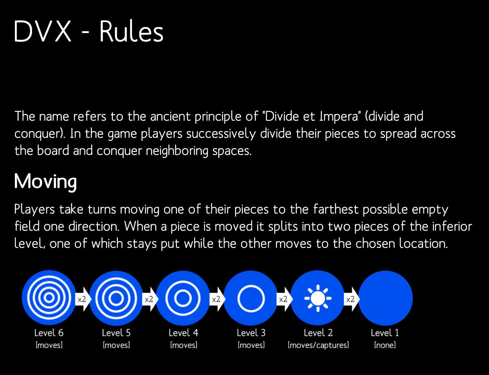
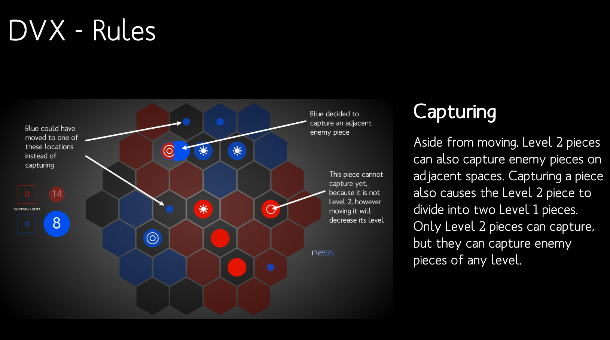
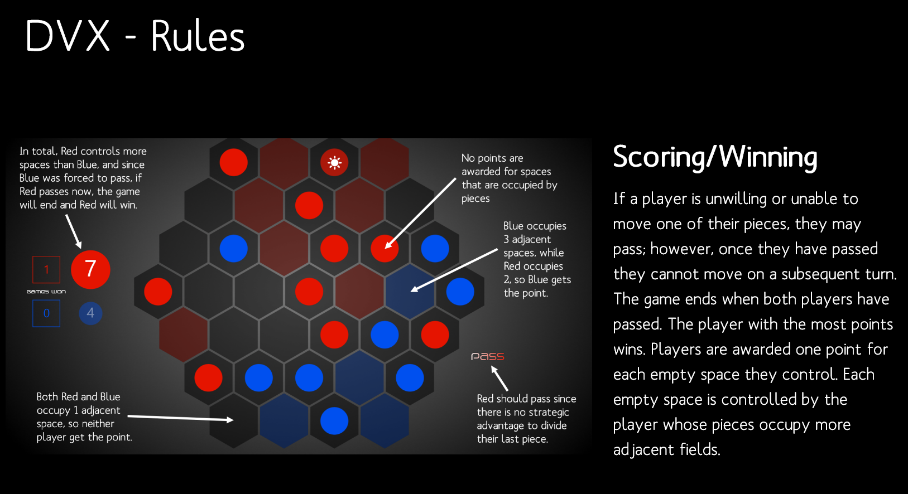

# DVX: Divide et Impera

This is a relatively simple two player abstract strategy, which nevertheless has a surprising amount of depth. The goal is to dominate as much of the board as possible, while simultaneously preventing your opponent from doing the same, occasionally by gobbling up their pieces.

Angelika Leeb and I developed this game in my senior year of high school, and it was published in the Microsoft Store in April 2015. The game is available for free [here](https://www.microsoft.com/store/productid/9NBLGGGZ4XQ7).

The game is somewhat related to [Battle Sheep](https://boardgamegeek.com/boardgame/54137/battle-sheep), and in fact, we came up with the idea for this game when we misunderstood the rules for Battle Sheep. We realized that our version was actually significantly more strategic, and thus decided to develop it further.

Here are the rules (also available in the app):

